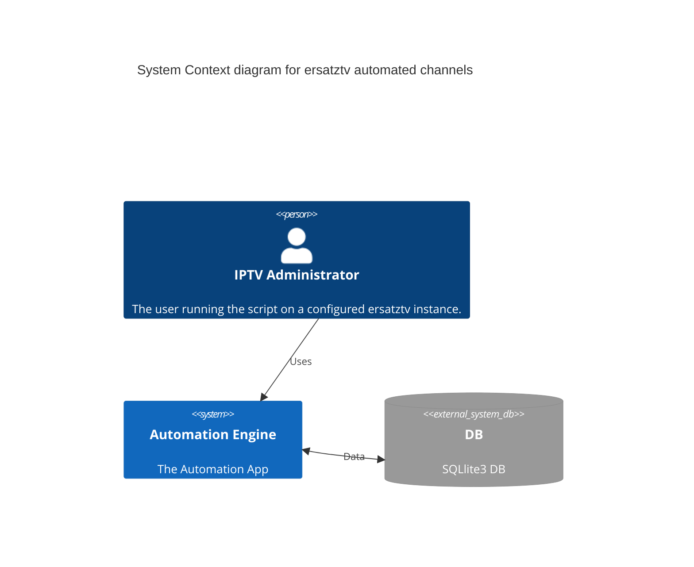

# ErsatzTV Channel AutoGen

I always wanted to have my own IPTV service - and now with ErsatzTV it's pretty damned simple.. so I can get started; 
- Crazy simple setup 
- Great automation

but I can't face the possibility of manually adding the thousands of media items, and from what Ive seen so far, the only option to setup a channel is manually via the WebUI. I wanted to start on some automation tooling to keep my hands busy while we wait for La Revolution and eat all the rich people... 

I'm going to start small and simple - and will probably just add more and more features until it does everything or Im too stuffed with Jeff Bezos meat.

<table>
<tr>
<td style="width:50%">
  

  
current manual process

<ul>
  <li>locate your media item</li>
  <li>add media item to an existing or new channel</li>
  <li>add a new FillerPreset</li>
  <li>set the FillerPreset as Fallback</li>
  <li>Create a new channel</li>
  <li>Create a new group</li>
  <li>Add all the categories etc</li>
  <li>Add Poster</li>
  <li>publish m3u</li>
</ul>

by using one filler preset for each media item, your channel will start playing on demand rather than part way thru
  

</td>
<td style="width:50%">
  

  
the awesome plan

    
<ul>
  <li>Read existing libraries from the DB file</li>
  <li>For each media item in the Movie table</li>
    <ul>
      <li>get the item ID</li>
      <li>lookup the Title from MediaMetadata</li>
      <li>If !exist, create a new Collection named "$TITLE" in table Collection</li>
      <li>Insert a new item in the new Collection linking CollectionId and MediaItemId</li>
      <li>if !Exist, create a new entry in table FillerPreset</li>
      <li>if !Exist, create a new channel named "${TITLE}", under some group (TBC) and set the FallbackFiller to your collection</li>
      </ul>
  This functionality doesn't go anywhere near as far is I hope to - but start simple and iterate 
</ul>  

</td>
</tr>
</table>

  

# TLDR;
start of developing a channel autopopulator for ErsatzTV [https://github.com/ErsatzTV/ErsatzTV](https://github.com/ErsatzTV/ErsatzTV) IPTV Streamer 

## C4 Design Diagram

