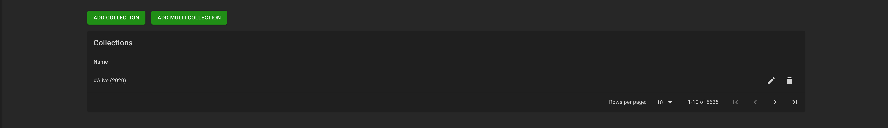
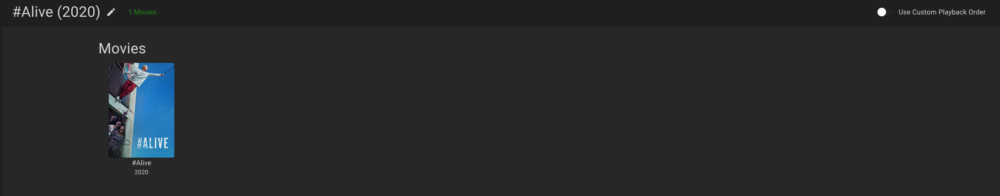
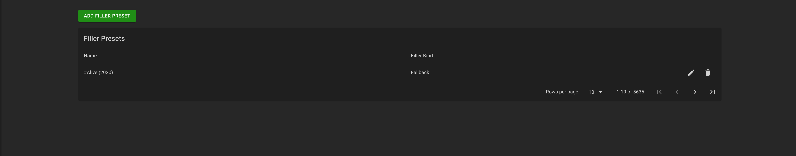
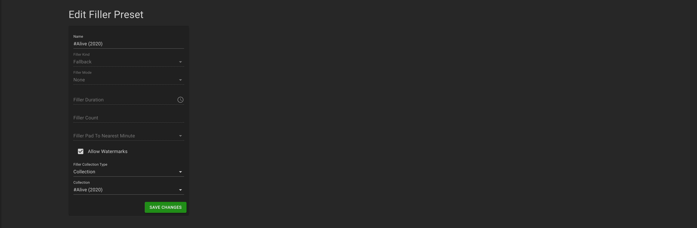
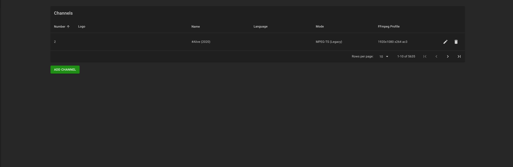
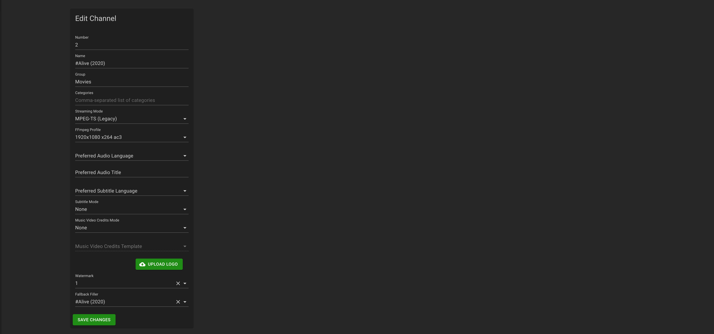

# Pre-release 0.2
## Preparation
- Install and configure ErsatzTV
  - delete sample channel
  - configure Default encoding profile
  - configure default watermark
  - configure general settings
    - check default profile

- Connect your plex media server
- Sync the Movies & TV Shows Libraries
- Wait for sync to finish

:warning: **This is a work in progress - backup your DB first!!**


## Application
- Shutdown ErsatzTV 
- Backup ersatztv.sqlite3 DB
- Either
### Run application
```
cp /config/ersatztv.sqlite3 .
python3 ./iteration2.1.py movies
python3 ./iteration2.1.py shows
```

### Run container
`docker run -it --rm -v /pathto/ersatztv.sqlite3:/app/ersatztv.sqlite3 pknw1/ersatztv-bulkadd-channels:latest movies`
[](https://asciinema.org/a/xSd87NdXs6uZYinEp5dEW3ApB)
[]
[]
[]
[]
[]
[]


`docker run -it --rm -v /pathto/ersatztv.sqlite3:/app/ersatztv.sqlite3 pknw1/ersatztv-bulkadd-channels:latest shows`
[](https://asciinema.org/a/dNoXOhHu3AEbzIKs2ZCB7yRte)


